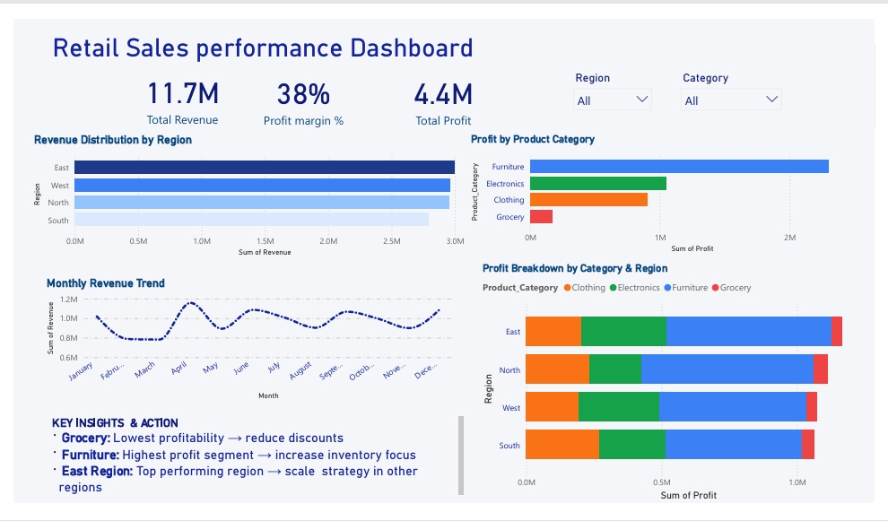

🛒 Retail Sales & Profit Analysis Dashboard (Power BI)
📌 Overview

This project delivers an interactive Power BI dashboard designed to analyze retail sales performance, profitability drivers, and regional dynamics.
Rather than focusing solely on revenue, the analysis emphasizes profitability optimization, identifying where the business is generating value and where margin leakage occurs.
The objective is to support data-driven decisions around pricing, product strategy, and regional expansion.

🛠️ Tools & Techniques
Power BI – Data modeling, dashboard design, and interactive reporting
DAX – KPI calculations (Profit Margin %, Category Contribution, Trend Analysis)
Data Analysis – Profitability segmentation, regional comparison, performance diagnostics

📊 Key Metrics
Total Revenue: 12M+
Total Profit: 4.5M+
Profit Margin: 37.7%

🔍 Key Insights
Profit Concentration Risk
The East region contributes ~40% of total profit, indicating strong performance but also creating dependency on a single region.
Category Profitability Imbalance
Furniture is the primary profit driver, suggesting high margins and strong product-market fit.
Margin Leakage in Grocery
While Grocery generates consistent revenue, margins remain below 10%, indicating heavy discounting or high cost of goods.
Revenue ≠ Profit
Several high-revenue segments contribute disproportionately less profit, highlighting inefficiencies in pricing and cost structure.

📈 Strategic Recommendations
1. Margin Optimization – Grocery Category
Reduce discounts selectively on price-inelastic, high-demand products
Renegotiate supplier contracts or optimize sourcing costs
Introduce pricing tiers to balance volume and margin

Target: Increase margin from <10% → ~15%
Expected Impact: Improved overall profitability without relying on additional sales volume

2. Scale What Works – Furniture Category
Expand inventory for high-performing SKUs
Promote premium products to increase average order value
Allocate higher marketing spend to maximize ROI

Rationale: Proven high-margin category with strong demand elasticity

3. Replicate Success – East Region Strategy
Analyze drivers such as:
Product mix
Discounting patterns
Customer purchasing behavior
Pilot replication in one underperforming region before scaling

Goal: Reduce regional performance gap and diversify profit sources

📊 Business Impact (Estimated)
Improving Grocery margins to ~15% could increase total profit by 5–10%, assuming stable demand
Scaling Furniture category is likely to drive both revenue and margin expansion
Replicating East region strategies can unlock untapped profitability in weaker regions

⚠️ Assumptions & Risks
Reduced discounting may impact sales volume in price-sensitive segments
Increased inventory in Furniture introduces holding and demand risk
Regional strategies may not fully translate due to demographic differences
Analysis assumes stable external factors (market demand, competition, supply costs)

👥 Stakeholder Value
Business Leaders: Clear visibility into profit drivers and strategic growth areas
Sales Teams: Focus on high-margin products and optimized pricing strategies
Operations: Identify cost inefficiencies and supplier optimization opportunities
Executives: Enable decisions based on profitability, not just revenue

📷 Dashboard Preview

  

Interactive dashboard highlighting sales trends, profitability insights, and regional performance.

 📁 Project File
Download here: https://drive.google.com/file/d/1qPaRqcDcuTgIX3j3iSItM2mwOgNJ6gI0/view?usp=drive_link
Complete Power BI file including data model, DAX measures, and report pages

📌 Conclusion

This analysis demonstrates that revenue alone is a misleading indicator of business performance. Profitability is heavily concentrated in specific categories and regions, while others contribute to revenue without delivering meaningful returns.

The business currently faces:

Margin inefficiencies in Grocery
Over-reliance on Furniture and the East region

By addressing these issues through targeted margin optimization and strategic scaling, the company can achieve sustainable profit growth without aggressive revenue expansion.

This dashboard enables a shift from descriptive reporting → strategic decision-making, focusing on where the business truly creates value.

